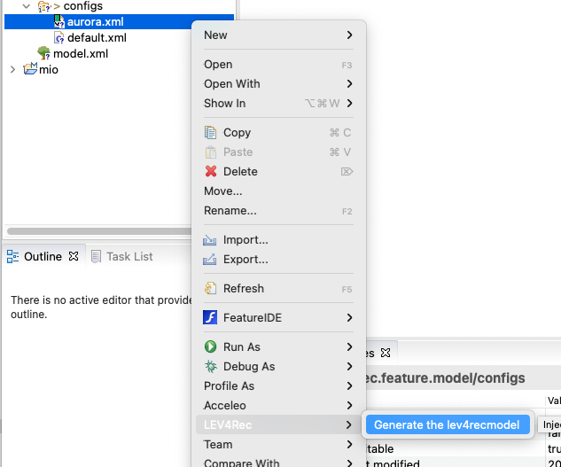
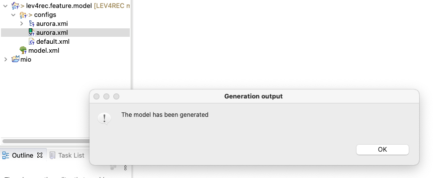
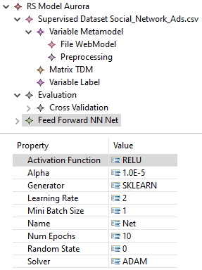
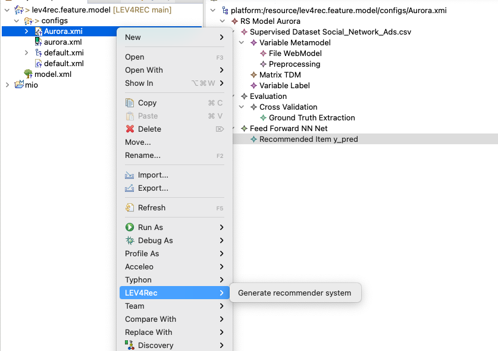
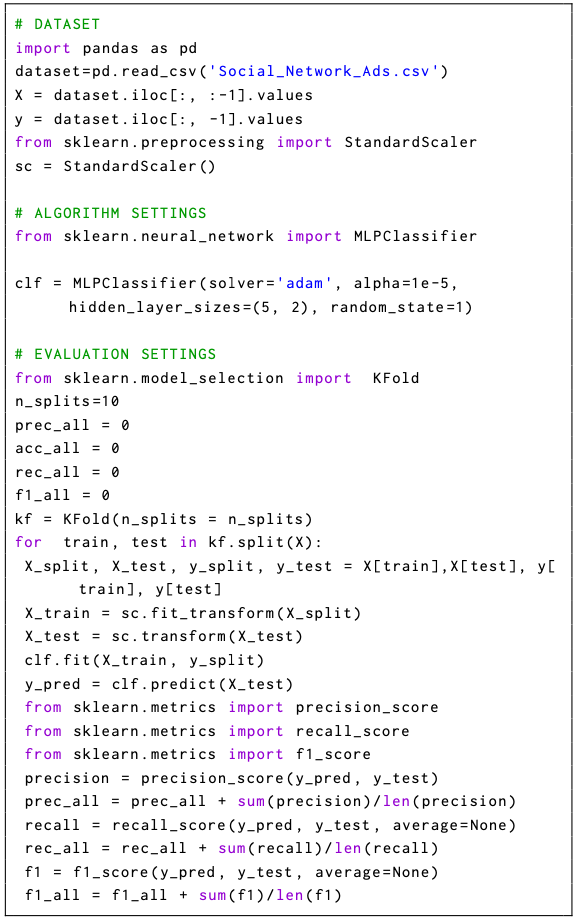

## LEV4REC environment
LEV4REC has been developed as an Eclipse project. First, you have to download Eclipse JEE (2020-06 distribution) from [here](https://www.eclipse.org/downloads/) and install the following plug-in:

 - EMF modeling tool SDK needed to edit the metamodel and models (update site [here](https://download.eclipse.org/modeling/emf/emf/builds/index.html))
 - FeatureIDE to modify the feature model directly from Eclipse Marketplace (Help > Eclipse Marketplace and then searching for FeatureIDE)
 - Acceleo to generate the source code (update site [here](https://www.eclipse.org/acceleo/download.html))
 - (Optional) ATL to register the metamodel (update site [here](https://download.eclipse.org/mmt/atl/updates/releases/))

## LEV4REC structure

The architecture relies on two different Eclipse projects. One is devoted to extending/personalize the three main components i.e., the feature model, the metamodel, and Acceleo templates. The second one is an Eclipse run-time project that can be used to test the whole LEV4REC workflow from the features' specification to the source code generation. Overall, the system is composed of the following plug-ins: 

 - **lev4rec.code.template**: this component produces the source code by using Acceleo templates
 - **lev4rec.feature.model**: it represents the feature model and the derived configuration for the two examined RSs in the study
 - **lev4.rec.model** : it contains the metamodel and the conform models 
 - **lev4rec.model.generator**: this component produces the coarse-grain model from the feature configuration
 - **lev4rec.ui**: it handles GUI components in the run-time environment

 
 
## Installation
To install LEV4REC, please follow these steps:

1. Install **Eclipse Modeling Framework** according to 2020-06 distribution from this link: [Eclipse](https://www.eclipse.org/downloads/).
2. Install [FeatureIDE](https://featureide.github.io/) plugin.
3. In Eclipse, import **lev4rec.code.template**, **lev4.rec.model,** and  **lev4rec.model.generator** in this order projects by navigating to `File > Import > Existing Projects into Workspace` and pointing the root directory to this. If have installed ATL plug-in, you have to register the metamodel to generate the source code (right-click on the metamodel and choose Register EPackage). If not, you have to edit and save all Acceleo templates (Eclipse registers the metamodel automatically). All projects should compile without any issue.

## Tool Usage
1. Once you import all the projects, you have to choose a new run-time instance of Eclipse by selecting `Run > Run Configurations... > Eclipse Application`.  In this new Eclipse instance, you have to import the **lev4rec.feature.model** project. You should see the **model.xml** file that is the main feature model and the **configs** folder. In this folder, you can create the configuration file to specify the system's features (`Right-click > New > Configuration file under Feature IDE sub-menu`). The figure below shows the expected configuration model:

2. Then next step is the generation of the LEV4REC model using the  **lev4rec.model.generator** module. The pictures below show the process:

Starting from the Configuration file expressed in the xml format, the system automatically generates the xmi model e.g. the Aurora model depicted in the image

By relying on the EMF editor, you can access and modify the attributes of the generated coarse-grain model:

3. Starting from the refined LEV4REC model, you can generate the recommender system using the **lev4rec.code.template** component.

At the end of the process, you can obtain the actual Python code that implements the specified system:

